# Talkdesk Public API - FAQ

## How to setup your environment?
To test the API by hand we highly advise the usage of Postman to do it ( https://www.getpostman.com/ ). No need for a premium account since the feature we will use are provided by the free edition.
After you’ve installed and registered, you’ll need to change one setting to make it easier to use Postman in general:
1. Go to settings
  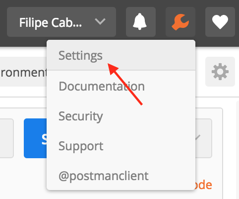

2. Toggle the option “Retain headers when clicking on links”

	1. 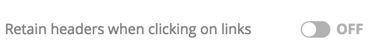

	2. 

3. Know you just need to set the URL and send requests by hitting send
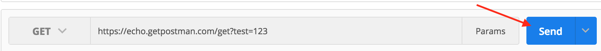

## What are headers and how do I use them?
Headers are part of the HTTP Protocol and they are used to add extra information into your requests and responses. In the case of our public API, they are used to set your credentials for example.

Using Postman you can setup the request headers by clicking on the tab “Headers” before making your request:

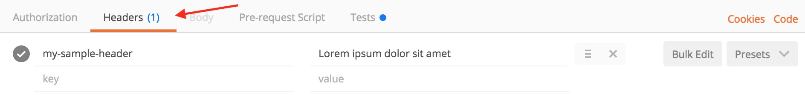

## What’s the difference between GET / POST / DELETE?
This is called HTTP Methods which will define the kind of action you want from the API:
* **GET:** Fetching operations
* **POST:** Create operations
* **DELETE:** Delete operations

The HTTP Method used by Postman can be set by using the dropdown menu:


****Warning: Be careful with the DELETE operations since you could delete important information with it! ****

## What’s a request Body and how do I use it?
In the body of the HTTP request you can pass the relevant information that will be used by the API to process a request (e.g. the start date and the end date of a report).


We use JSON format to detail this information and it will look something along this lines:
`{“name”:”John” , “surname”:”Doe”}`

The service will then analyze the content of the body, verify if they are valid and execute operations accordingly. If for some reason the content is invalid, it will return a HTTP Error 400 which we’ll detail later.
Another important thing to know is that body information it’s usually associated with HTTP Methods that handle Creating / Updating, so in our use case we need to:
1. Set method to POST
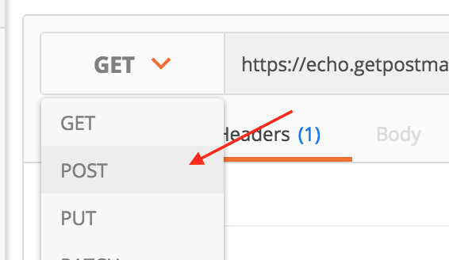

2. Go to the tab Body
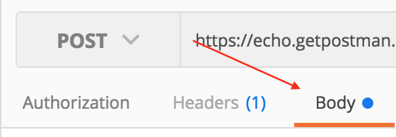

3. Set Radio button to “raw”
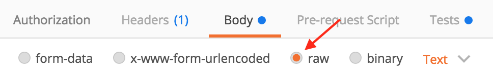

4. Change the type to JSON (application/json)
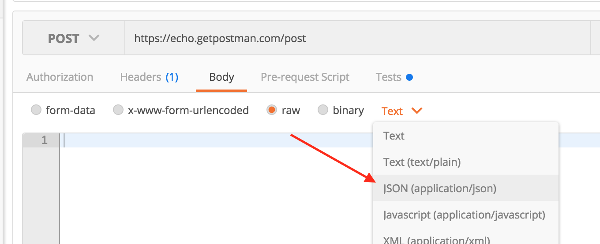

5. Write the body in JSON format
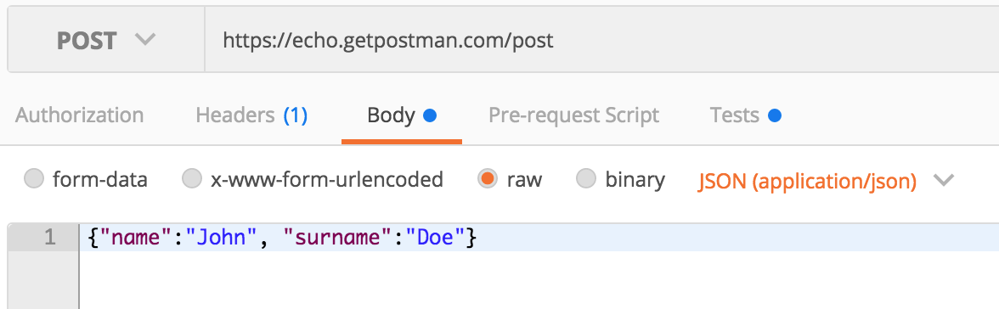

After this steps the body is ready to be sent to the URL you’ve set

## How can I fetch my Talkdesk credentials?
This is a real important element in the usage of our API since all requests from your side need to be authenticated. To retrieve your Access Token using Postman and lessons learned, create a POST request to https://api.talkdeskapp.com/token with the following body:
``` json
{
	"username": "< replace w/ username >",
	"password": "< replace w/ password >",
	"client_id": "< replace w/ client id provided >",
	"client_secret": "< replace w/ client secret provided >",
	"account": "< replace w/ account name>",
	"client_version": "1"
}
```

It should look like this:

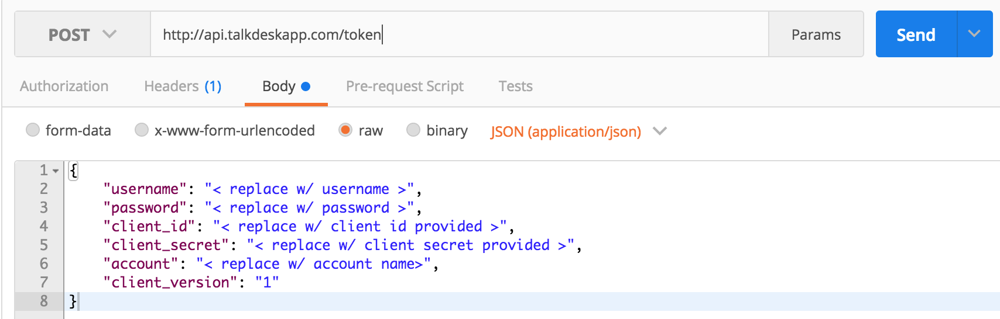

This request will return your Access Token that will be used for all Public API calls.

**Warning: Outside access to any element detailed here can lead to leaked information. Please be aware of the danger and be aware of the risks of poorly storing any element described here.**

## I have my credentials, now how can I use them?
For this we will use the Report API as an example and we will:
1. Create a Report

2. Fetch Report Details

3. Access the Report

All the steps assume you already have in your possession a valid Access Token
### 1. Create a report
1. Set the URL to https://api.talkdeskapp.com/reports/calls/jobs

2. Set HTTP Method to POST

3. Add Header `Authorization` with the value `Bearer <Access Token>`
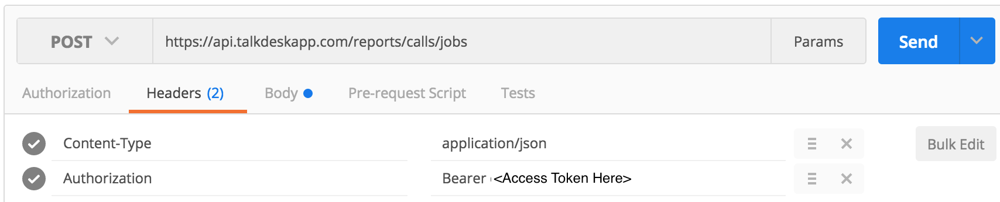

4. Add Body in JSON format with the following information
``` json
{
 "timespan": {
       "from": "2016-07-01T22:13:12Z",
       "to": "2016-07-05T22:13:12Z"
   	}
}
```

5. Hit send


**Note:** Change the dates with your use case.
Hit Send

The response will include an ID field (similar to `58010fa7dfc216083f00000d`). This will be used to track the status of this specific report so keep it for the other use cases we’ll do here.

### Fetch Report Details
1. Set the URL to https://api.talkdeskapp.com/reports/calls/jobs/<ReportID>

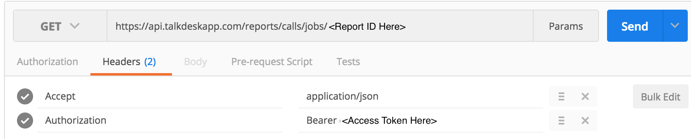

2. Set HTTP Method to GET

3. Add Header `Authorization` with the value `Bearer <Access Token>`

4. Hit Send


### Access the Report
1. Set the URL to https://api.talkdeskapp.com/reports/calls/files/<ReportID>

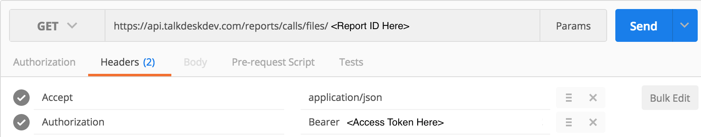

2. Set HTTP Method to GET

3. Add Header `Authorization` with the value `Bearer <Access Token>`

4. Hit Send

This will return text containing the link from which you’ll be able to download your report file:
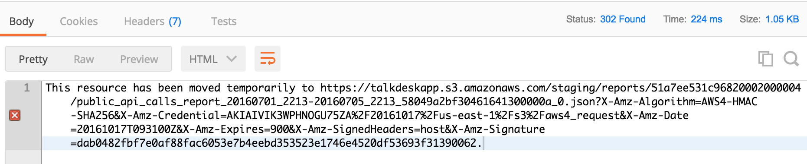

**Note:** If you click the link directly it will present a problem because the last character in that URL contains a `.` that isn't part of the URL, as such don't forget to remove it the `.` in the end of the URL

## How can I check errors?
HTTP responses also use headers to give us some information regarding why it failed by returning a code that will help us track the problem. In this example, Postman warns us that the response status is `404 Not Found`:
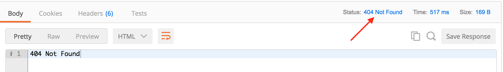

In other responses you’ll actually receive some extra information in the response body. In this example we see that we had a status `400 Bad Request` and the body of the responses contains some extra information that we will detail in the next sections:
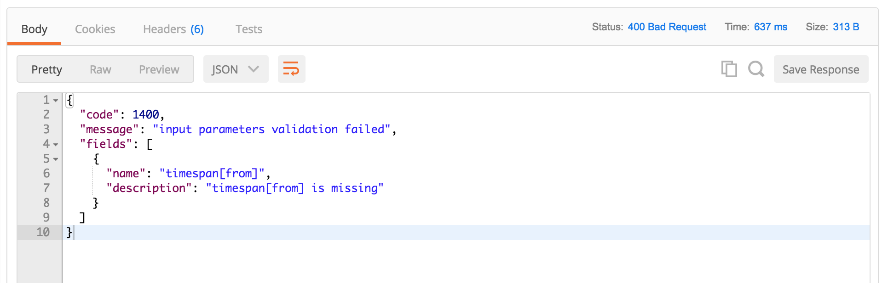

## How to handle error 400 ?
This usually is associated with wrong parameters in your request. The best way to handle this kind of error is to check the error message and then look at the body of your request to check if there’s any field wrongly types or set.

Also don’t forget that the date format is `<YYYY>-<MM>-<DD>T<HH>:<MM>:<SS>Z` for example `2016-07-01T22:13:12Z`.
## How to handle error 404?

There are two possible reasons for this type of errors:
1. You’re making a request to an URL that doesn’t exist, for example if you try to make a request to https://api.talkdeskapp.com/tokens instead of https://api.talkdeskapp.com/token it would fail because of that extra `s`.
	* **Solution:**  Please check the URL used to make your request and check the documentation.
2. Fetching non existent ID or it's not ready yet.
	* **Solution:** Check the status of the job by requesting details, even if this returns 404 it means that the system can’t find the ID you’re specifying so there could be a typo and the job doesn’t exist.

## How to handle error 403 ?
This code usually is associated with requests using the wrong type of credentials, please refer to the step “How can I fetch my credentials?” and try to refresh your credentials. If this still doesn’t work please contact us.

## How to handle error 500 ?
This code usually is associated with requests failing in our servers so in this case please contact us with the `platform-tid` in the header of the response.
